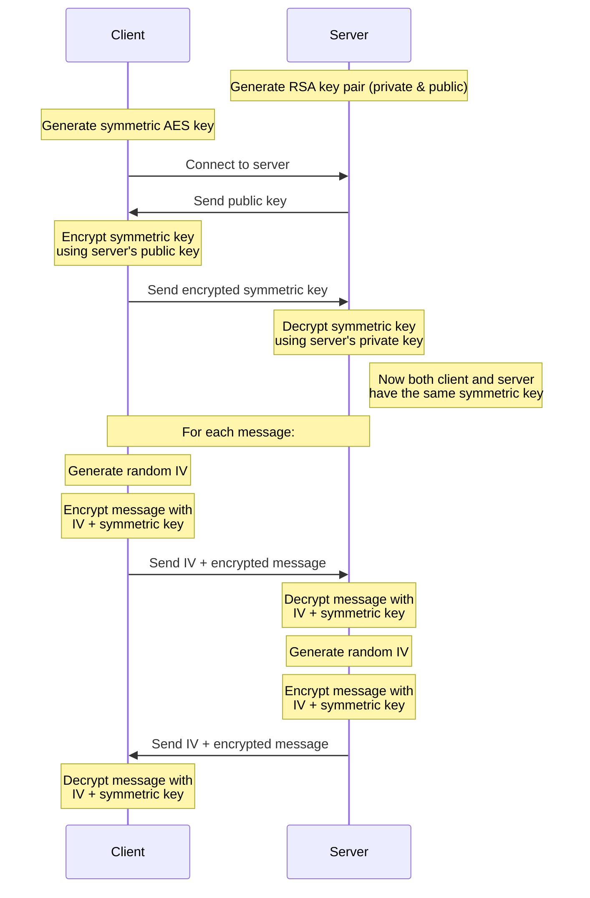

# Client Server chat (messenger) with encryption.
Secure client-server chat application using raw socket encryption without SSL/TLS certificates over TCP/IP sockets using C.
- Communication encryption Used :
  - RSA (2048-bit) for secure key exchange
  - AES-128 for fast, efficient message encryption
  - Proper IV management for cryptographic security
- Components
  - multithreads in both client and servers: one for receiving and the other for sending.
  - a portable crypto library (used for raw text encryption/decryption).

## Without encryption
  
  

  
  

## With encryption

## How it works ?

## how to run it
for server :

    gcc server.c  -lcrypto -o server && ./server 
for client 

    gcc client.c -lcrypto -o client && ./client

## Need to add

 - Multi-users (clients) , instead of only one client. (group of chat).
 - Optimize it : using stack instead of global variables.
 - Also im thinking about integrating some asm code.
